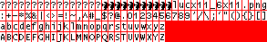
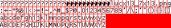
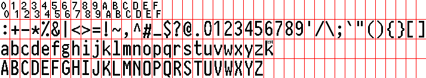

```
input files: 10x20.png, 16x32.png
glyphs are read from black pixels, 1 px padding (red)
for 10x20, width: 461 (41+42*10), height: 3+4*20 (83)

16 0123456789ABCDE (small double numbers for non-printable)
42 :+-*%&|<>=!~,^#_$?@.0123456789'/\;`"(){}[]
26 abcdefghijklmnopqrstuvwxyz
26 ABCDEFGHIJKLMNOPQRSTUVWXYZ

k font files are generated with:
 go run gen.go lucx11_6x11.png > luc11.k
 go run gen.go lucx13_7x13.png > luc13.k
 go run gen.go zeev8x16.png 8 16 > f1.k
 go run gen.go 10x20.png 10 20 > f2.k
 go run gen.go 16x32.png 16 32 > f3.k

/unpack (linear black-pixel indexes)
\l f2.k
font:{&,/+(8#2)\:'0+x}'font
```

# 6x11, 7x13


```
from plan9 (lstr.10, lstr.12) (lucidasans?)
 go run png.go lucx11.font
 go run png.go lucx13.font
```

# 8x16

```
from zeev, 1px line with
 http://zevv.nl/play/code/zevv-peep/zevv-peep-iso8859-1-08x16.bdf > zeev.bdf
 go run png.go zeev.bdf
```

# 10x20

```
manual work, 2px line width, modified misc-10x20, taller thicker characters
```

# 16x32

```
manual work, 3px line width, proportions inspired by PragmataPro
```
